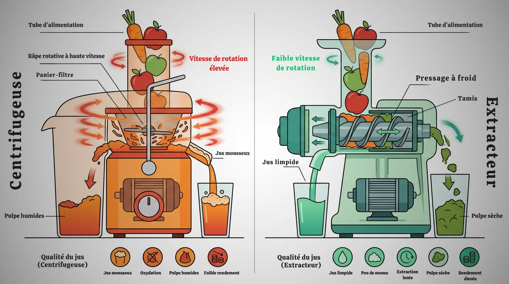

## La vitesse, premier critère de tri

Vous voulez faire des jus frais, mais face au rayon, c'est le flou. Les deux machines promettent la même chose, mais leur fonctionnement est radicalement opposé. C'est une question de physique, et cela change tout dans votre verre.

Une centrifugeuse utilise la force du même nom. Imaginez une râpe métallique qui tourne à une vitesse extrême, entre 6 000 et 15 000 tours par minute. Les aliments sont projetés, broyés, et le jus est expulsé à travers un tamis. C’est rapide, brutal et efficace en apparence.

L'extracteur de jus, lui, est un adepte de la lenteur. Une vis sans fin tourne doucement, entre 40 et 110 tours par minute. Elle presse et mâche les aliments contre un tamis pour en extraire le jus. Cette méthode, appelée pressage à froid, est un processus mécanique lent. **La différence de vitesse est la clé de la qualité nutritionnelle** que vous obtiendrez.


Un extracteur presse lentement (40-110 tr/min) pour un jus riche en vitamines, qui se conserve 24h. Une centrifugeuse (10 000+ tr/min) est rapide, mais son jus s'oxyde en 15 minutes et perd ses nutriments. Votre choix impacte directement la qualité de ce que vous buvez et le rendement de vos fruits.


## Le rendement : moins de pulpe, plus de jus

Vous achetez des fruits et légumes de qualité, souvent bio. Chaque gramme compte dans votre budget. La question du rendement n'est donc pas un détail, c'est le cœur de votre investissement sur le long terme.

La centrifugeuse, par sa vitesse, projette la pulpe contre les parois. Cette pulpe est souvent encore gorgée de jus. C'est une perte sèche. Vous jetez une partie non négligeable de vos aliments et de votre argent. La pulpe est très humide, difficile à réutiliser.

L'extracteur, avec son pressage lent et puissant, essore la matière végétale. La vis sans fin comprime les fibres jusqu'à en extraire la quasi-totalité du liquide. La pulpe qui en ressort est très sèche, presque comme de la sciure. **Vous obtenez jusqu'à 30% de jus en plus** pour la même quantité de végétaux. Sur une année, l'économie est substantielle. Pensez à un kilo de carottes : vous remplirez un grand verre avec un extracteur, contre un verre moyen avec une centrifugeuse.

## Qualité nutritionnelle : une question de chaleur et d'oxydation

Le but premier d'un jus frais est d'apporter à votre corps un maximum de nutriments. Or, la méthode d'extraction a un impact direct sur la survie des vitamines, minéraux et enzymes. Ce sont des molécules fragiles.

La rotation ultra-rapide de la centrifugeuse a deux conséquences néfastes. D'abord, elle génère de la chaleur par friction, ce qui peut dégrader les enzymes et les vitamines les plus sensibles, comme la vitamine C. Ensuite, elle incorpore une grande quantité d'air dans le jus, provoquant une oxydation quasi instantanée. Vous le voyez à la mousse qui se forme et à la couleur qui change vite. Un jus de centrifugeuse doit être bu dans les 15 minutes.

Le pressage à froid de l'extracteur limite drastiquement ces deux problèmes. La rotation lente ne chauffe pas les aliments. Moins d'air est incorporé, l'oxydation est donc très faible. **Votre jus est plus dense, plus homogène et conserve ses nutriments intacts**. Vous pouvez le conserver jusqu'à 24 heures au réfrigérateur dans une bouteille bien fermée. C'est un avantage majeur pour préparer vos jus à l'avance. Moins d'oxygène et de chaleur, meilleure est la préservation des nutriments.

## Polyvalence : des jus d'herbes aux laits végétaux

Votre appareil ne devrait pas se limiter au classique jus de pomme-carotte. La capacité à traiter une large gamme d'aliments détermine si votre machine restera sur le plan de travail ou finira au fond d'un placard.

La centrifugeuse est très limitée. Elle fonctionne bien avec les fruits et légumes durs et juteux. Mais essayez de passer des épinards, du chou kale, des herbes aromatiques ou des feuilles de menthe : vous obtiendrez très peu de jus. La force centrifuge est inefficace sur les aliments fibreux et légers. Les oléagineux pour faire des laits végétaux ? Impossible.

L'extracteur est le champion de la polyvalence. Sa vis puissante broie tout sur son passage. **Vous pouvez extraire le jus des légumes-feuilles les plus coriaces, des herbes, et même des germes de blé**. Mieux encore, la plupart des modèles permettent de réaliser des laits végétaux (amande, noisette), des purées d'oléagineux, des sorbets avec des fruits congelés, et même des pâtes fraîches pour certains. C'est un véritable outil de cuisine, pas seulement une machine à jus.

## Le quotidien : bruit, nettoyage et préparation

Un bon appareil est un appareil que l'on utilise. L'ergonomie, le bruit et la facilité de nettoyage sont des critères aussi importants que la performance pure. Votre routine matinale ne doit pas se transformer en corvée.

La centrifugeuse est rapide à l'usage, mais très bruyante. Son moteur de plus de 10 000 tours/minute fait le bruit d'un aspirateur. C'est un réveil assuré pour toute la maison. Sa large goulotte permet souvent d'insérer des fruits entiers, ce qui réduit le temps de préparation. Le nettoyage, en revanche, est son point faible. Le tamis-râpe est une pièce complexe, pleine de micro-trous qui retiennent les fibres et demandent un brossage méticuleux.

L'extracteur est remarquablement silencieux. Vous pouvez préparer un jus à 6h du matin sans déranger personne. En contrepartie, il demande un peu plus de préparation : il faut couper les fruits et légumes en morceaux pour les insérer dans une goulotte souvent plus étroite. Le nettoyage est généralement plus simple. Les pièces (vis, tamis, capuchon) sont lisses et se rincent facilement sous l'eau claire juste après utilisation. Préparer les aliments demande de bons outils.

## Le budget : un investissement, pas une dépense

Le prix est souvent le facteur décisif. Et sur ce point, l'écart est net. Une centrifugeuse d'entrée de gamme se trouve à partir de 50€, tandis qu'un bon extracteur démarre rarement en dessous de 200€ et peut dépasser les 500€.

Voir la centrifugeuse comme une économie serait une erreur de calcul. Son faible rendement vous oblige à acheter plus de végétaux pour obtenir la même quantité de jus. Si vous faites un jus par jour, le surcoût en matières premières devient significatif au bout d'un an. **L'investissement initial plus élevé de l'extracteur est amorti par les économies réalisées sur vos courses**.

Pensez-y comme un calcul de rentabilité. La centrifugeuse est une dépense pour un usage occasionnel. L'extracteur est un investissement pour une utilisation régulière, qui se justifie par le gain en rendement, la qualité nutritionnelle supérieure et une bien plus grande polyvalence. C'est un choix qui s'aligne avec une volonté de consommer mieux et de gaspiller moins.

## FAQ : Extracteurs vs Centrifugeuses

**Quelle est la différence entre un extracteur vertical et horizontal ?**
Les extracteurs verticaux sont plus compacts et souvent un peu plus rapides à nettoyer, idéals pour les jus de fruits et légumes mixtes. Les modèles horizontaux sont généralement plus polyvalents, excellant avec les légumes fibreux (céleri, kale) et permettant souvent de faire des purées ou des pâtes. Votre choix dépendra de votre usage principal et de l'espace sur votre plan de travail.

**Puis-je mettre des agrumes avec la peau dans ces machines ?**
Non, il est déconseillé de le faire. La peau des agrumes (citrons, oranges, pamplemousses) contient des composés amers et des huiles essentielles qui peuvent donner un mauvais goût au jus et être difficiles à digérer. Pelez toujours vos agrumes avant de les passer dans une centrifugeuse ou un extracteur.

**Est-ce que je perds toutes les fibres en faisant des jus ?**
Oui, le principe de ces deux appareils est de séparer le jus (liquide, vitamines, minéraux) des fibres (pulpe). Vous perdez donc la majorité des fibres insolubles. C'est d'ailleurs ce qui rend les nutriments très rapidement assimilables par l'organisme. Pour un apport en fibres, il faut consommer le fruit entier ou réaliser des smoothies au blender, qui lui, ne sépare rien.