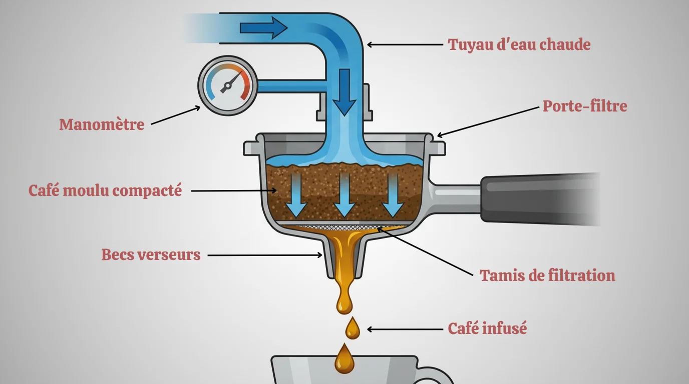

## La pression : pourquoi 9 bars suffisent

Votre espresso est souvent amer ou sans corps ? Le coupable n'est pas toujours le grain de café. C'est souvent la pression. Les fiches techniques affichent fièrement 15, 19, voire 20 bars. C'est un argument marketing qui masque l'essentiel.


Oubliez la course aux bars. La pression idéale pour un espresso est de 9 bars, appliquée de manière stable sur la mouture. Au-delà, l'eau crée des canaux, sous-extrait certaines parties et brûle les autres. Le résultat : un café amer. Votre critère de choix n'est pas le chiffre, mais la stabilité.


La physique est simple. Une pression trop élevée force l'eau à traverser la galette de café trop vite et de manière inégale. Elle crée des "canaux" préférentiels, laissant une partie de la mouture sèche et sur-extrayant l'autre. C'est ce qu'on appelle le "channeling", et c'est l'ennemi juré d'un bon espresso.

Une machine de qualité ne se vante pas de ses 19 bars. Elle assure une pression constante et bien calibrée de 9 bars au niveau du groupe infuseur. C'est cette constance qui garantit que toute la mouture est infusée uniformément, extrayant les huiles et les arômes de façon équilibrée. **Vous obtenez une crema dense et un goût riche, pas une tasse d'eau amère**.

## Le broyeur : le cœur de votre machine

Vous utilisez les mêmes grains, mais votre café a un goût différent chaque matin ? Le problème vient de votre broyeur. C'est la pièce la plus importante d'une machine à grains, bien avant la pompe ou l'écran tactile. Sa mission : transformer les grains en une poudre à la granulométrie parfaitement homogène.

Les broyeurs bas de gamme produisent une mouture inégale, avec de gros morceaux et de la poudre très fine. Les gros morceaux sont sous-extraits (goût acide), tandis que les fines particules sont sur-extraites (goût amer). Le mélange des deux donne un résultat plat et décevant.

J'ai un ami qui venait d'investir 800€ dans une machine. Il se plaignait que son café de torréfacteur était "moins bon que ses vieilles capsules". Une hérésie. En arrivant chez lui, je n'ai pas regardé le paquet de grains. J'ai ouvert la trappe du broyeur. Le réglage était sur la mouture la plus grossière possible, celle pour du café filtre. On a tout nettoyé, passé le réglage sur une mouture fine, et relancé un espresso. Il a retrouvé le sourire. **La meilleure machine du monde avec un mauvais réglage de broyeur produira toujours un mauvais café**.

Les meilleurs broyeurs utilisent des meules coniques ou plates, en acier ou en céramique. L'acier est souvent plus précis au début, mais peut chauffer légèrement le café. La céramique est plus neutre thermiquement et très durable, mais peut être plus fragile. Le vrai critère est le nombre de niveaux de réglage. Une bonne machine vous offrira au moins 5 à 10 finesses de mouture différentes. **Cela vous donne le contrôle total pour adapter l'extraction à votre grain de café**.

## La température : le PID, votre meilleur allié

Votre café est parfois acide, parfois brûlé ? La température de l'eau est en cause. Une eau trop froide sous-extrait le café, libérant principalement l'acidité. Une eau trop chaude le brûle, créant une amertume désagréable. La fenêtre de tir pour un espresso est très étroite : entre 90°C et 95°C.

Les machines d'entrée de gamme utilisent un simple thermostat qui allume et éteint la résistance. La température oscille alors de plusieurs degrés autour de la cible. C'est la loterie dans la tasse. Les machines sérieuses intègrent un contrôleur PID (Proportional-Integral-Derivative). Ce système intelligent anticipe les variations et maintient l'eau à une température stable, au dixième de degré près.

Cette stabilité thermique est assurée par un thermoblock ou une chaudière. Le thermoblock chauffe l'eau à la demande, c'est plus rapide et économe. La chaudière garde un volume d'eau chaude constant, offrant une meilleure inertie thermique. Dans les deux cas, le PID fait la différence. **Il vous assure une constance parfaite, tasse après tasse**.

## Le groupe infuseur : mécanique et hygiène

Le bruit mécanique que vous entendez après le broyage, c'est le groupe infuseur qui se met au travail. C'est le piston qui reçoit la mouture, la tasse pour former une galette compacte, gère l'infusion sous pression, puis éjecte le marc de café usagé. La conception de cette pièce a un impact direct sur la qualité de votre café et la facilité d'entretien.

Il existe deux écoles : les groupes amovibles et les groupes fixes. Un groupe amovible peut être retiré et rincé sous l'eau chaque semaine. C'est une garantie d'hygiène parfaite. Vous éliminez les vieux résidus de café et les huiles rances qui peuvent contaminer le goût de vos prochains expressos.

Un groupe fixe, lui, est nettoyé via des cycles automatiques avec des pastilles détergentes. C'est plus simple, mais moins transparent. Vous ne voyez jamais l'état réel de la pièce. Sur le long terme, des dépôts peuvent s'accumuler. **Choisir un groupe amovible, c'est choisir la maîtrise de l'hygiène et la longévité du goût pur de votre café**.

## Coût réel et optimisation : au-delà du prix d'achat

Une machine à grains représente un investissement. Mais est-ce vraiment plus cher que les capsules ? La réponse est non, et les chiffres le prouvent. Le calcul doit inclure le prix de la machine, le coût du café, l'électricité et l'entretien.

J'ai tenu les comptes pendant 6 mois après avoir abandonné les capsules. Mon coût par tasse est passé de 42 centimes à 17 centimes, en utilisant un excellent grain de torréfacteur. Sur l'année, **l'économie représente plus de 180€**, sans compter la réduction des déchets. C'est un calcul simple qui justifie l'investissement initial.

L'optimisation passe aussi par la gestion de l'énergie et de l'eau. Pensez aussi au calcaire : utiliser une cartouche filtrante ou de l'eau filtrée prolonge la vie de votre machine et réduit la fréquence des détartrages coûteux. C'est un point clé pour éviter les pannes.

## La buse vapeur : la science d'une micro-mousse

Si vous aimez les cappuccinos ou les lattes, la buse vapeur n'est pas un gadget. C'est un instrument de précision. Son rôle est d'injecter de la vapeur d'eau sous pression dans le lait pour le chauffer et créer une émulsion stable et soyeuse : la micro-mousse.

Les machines d'entrée de gamme sont souvent équipées d'une aide appelée "Pannarello". C'est un embout en plastique qui aspire de l'air pour créer une mousse épaisse et pleine de grosses bulles. C'est facile, mais le résultat est loin de celui d'un barista. Une vraie buse vapeur, en inox, avec une ou plusieurs sorties, vous donne le contrôle.

La technique consiste à positionner la buse juste sous la surface du lait pour l'étirer en incorporant de l'air, puis à la plonger pour créer un tourbillon qui homogénéise la texture. Cela demande un peu de pratique. Mais le résultat est sans appel : **une mousse fine, onctueuse et brillante qui se mélange parfaitement à l'espresso**. Le secret est dans la pression de la vapeur et la conception de la buse.

## FAQ - Vos questions sur les machines à grains

**Une machine à 19 bars est-elle meilleure qu'une à 15 bars ?**
Non. Ce chiffre est un argument marketing. La pression idéale pour l'extraction d'un espresso est de 9 bars, appliquée de manière stable au niveau de la mouture. Une pression trop forte crée un café amer. La qualité de la pompe se mesure à sa régularité, pas à sa puissance maximale.

**Broyeur en céramique ou en acier : quelle est la vraie différence ?**
Les deux technologies sont valables. L'acier offre des meules très affûtées pour une mouture précise, mais peut légèrement chauffer le grain. La céramique est thermiquement neutre, inusable et silencieuse, mais peut être plus sensible aux corps étrangers. Le plus important est le nombre de réglages de finesse, qui vous donne le contrôle.

**Faut-il nettoyer le groupe infuseur à chaque utilisation ?**
Non, pas à chaque utilisation. Si votre groupe est amovible, un rinçage à l'eau claire une fois par semaine est une bonne pratique. Un nettoyage complet avec un dégraissant est recommandé une fois par mois. Pour les groupes fixes, suivez le programme de nettoyage automatique de la machine quand elle le demande.

**Puis-je utiliser du café déjà moulu dans une machine à grains ?**
La plupart des machines disposent d'une trappe pour café moulu. C'est pratique pour un décaféiné occasionnel. Cependant, cela va à l'encontre du principe même de la machine : la fraîcheur. Le café perd ses arômes en moins de 15 minutes après avoir été moulu. Pour un résultat optimal, utilisez toujours des grains frais.