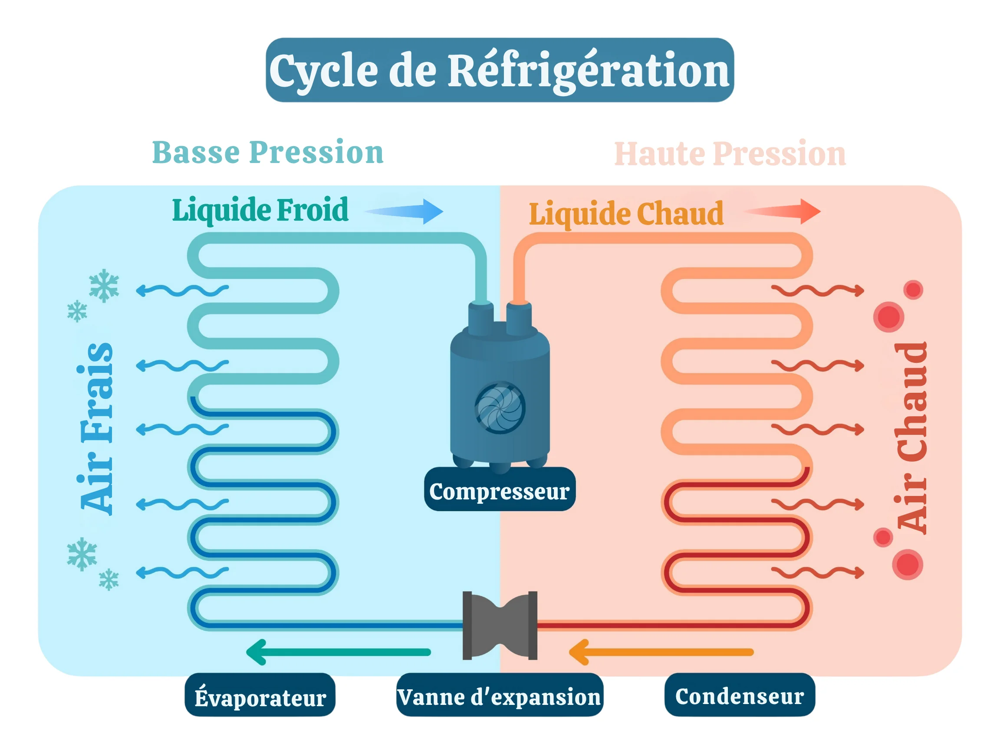

## Monobloc ou Split : le vrai coût du silence

Le bruit d'un climatiseur mobile peut vite transformer votre oasis de fraîcheur en zone industrielle. La source du problème est simple : le compresseur. Dans un modèle monobloc, il est dans la même unité que vous, dans votre pièce. Il est impossible d'échapper à son vrombissement.

Un climatiseur mobile split sépare l'unité intérieure (le ventilateur) de l'unité extérieure (le compresseur bruyant). Le gain acoustique est énorme. On passe de 60-65 décibels pour un monobloc standard, soit le bruit d'une conversation animée, à moins de 50 dB pour l'unité intérieure d'un split, ce qui se rapproche du bruit d'un réfrigérateur.

Le choix se fait donc sur ce critère. Si l'appareil est destiné à une chambre, un modèle split est presque obligatoire pour préserver votre sommeil.

## Simple gaine ou double gaine : le piège de la dépression

Votre climatiseur tourne à plein régime mais la pièce reste tiède ? C'est probablement un modèle à simple gaine. Ce système est un non-sens physique. Pour expulser l'air chaud dehors via sa gaine, l'appareil doit puiser de l'air dans votre pièce, créant une dépression.


Un climatiseur mobile simple gaine crée une dépression dans la pièce, aspirant l'air chaud extérieur par les fentes des portes et fenêtres. Un modèle double gaine utilise un circuit fermé, isolant l'air de refroidissement. **Votre pièce refroidit 40% plus vite et votre facture d'électricité baisse.** C'est un détail technique qui change tout.


La physique est têtue : pour combler ce vide, de l'air chaud de l'extérieur s'infiltre par le moindre interstice. Votre climatiseur se bat contre lui-même, essayant de refroidir une pièce qui se réchauffe en continu. C'est une perte d'énergie et d'efficacité.

Un modèle à double gaine résout ce problème. Une gaine aspire l'air extérieur pour refroidir le système, et l'autre expulse l'air chaud. Le circuit est fermé, il n'y a pas de dépression. **Vous obtenez un refroidissement plus rapide, plus stable, et une consommation électrique maîtrisée.** C'est le seul choix logique pour un usage régulier.

## BTU et puissance frigorifique : dimensionner sans se tromper

Acheter un climatiseur trop puissant est une erreur aussi coûteuse que d'en choisir un trop faible. La puissance de refroidissement, ou puissance frigorifique, est la clé. Elle est exprimée en BTU (British Thermal Unit) par heure, ou plus simplement en Watts. La conversion est simple : 1000 BTU/h valent environ 293 W.

La règle de base pour un logement correctement isolé est de compter 100 à 130 W par mètre carré. Pour une pièce de 25 m², il vous faudra donc un appareil d'environ 2500 W (soit 8500 BTU). N'allez pas au-delà. Un appareil surdimensionné refroidira l'air très vite, mais il s'arrêtera avant d'avoir eu le temps de déshumidifier correctement la pièce.

Vous vous retrouverez avec une atmosphère froide mais moite et désagréable. Un climatiseur correctement dimensionné tourne plus longtemps mais de manière plus douce. **Il assure un confort thermique et hygrométrique stable, sans surconsommation inutile.** Prenez les mesures de votre pièce et faites le calcul avant tout achat.

## Gestion des condensats : le bac, l'évaporation ou la pompe

En refroidissant l'air, un climatiseur extrait son humidité. Cette eau, appelée condensat, doit bien aller quelque part. Trois systèmes coexistent, avec des niveaux de contrainte très différents pour vous. Le plus basique est le bac de récupération. Quand il est plein, l'appareil s'arrête et vous devez le vider manuellement, parfois plusieurs fois par jour en climat humide.

La seconde option est l'auto-évaporation. Le climatiseur utilise la chaleur de son condenseur pour évaporer les condensats et les expulser via la gaine d'évacuation. C'est bien plus pratique, mais ce système a ses limites. Si l'air ambiant est très humide, l'évaporation peut ne pas suffire et le bac de secours se remplira quand même.

La solution la plus autonome est la pompe de relevage intégrée. Elle évacue l'eau en continu via un petit tuyau, que vous pouvez diriger vers une évacuation ou un grand récipient. C'est l'idéal pour un fonctionnement sans surveillance. **Vous gagnez la tranquillité d'esprit d'un fonctionnement réellement autonome.** [Déshumidificateur : Stop à la condensation et aux moisissures.](/maison/deshumidificateur-tout-comprendre-avant-acheter/)

## Le gaz réfrigérant : le R290, seul choix viable

Le fluide qui circule dans votre climatiseur pour capter la chaleur est un gaz réfrigérant. Pendant des années, les fabricants ont utilisé des fluides HFC comme le R410A. Leur problème : un Potentiel de Réchauffement Global (PRG) très élevé. Celui du R410A est 2088 fois supérieur à celui du CO2.

La réglementation européenne impose désormais des fluides bien plus respectueux de l'environnement. Le standard actuel est le R290, qui n'est autre que du propane purifié. Son PRG est de 3. Le gain pour la planète est colossal. Aujourd'hui, il n'y a plus aucune raison d'acheter un appareil fonctionnant avec un ancien gaz.

Vérifiez cette information sur la fiche technique. Elle est souvent indiquée sur une étiquette sur le côté de l'appareil. Choisir un climatiseur au R290, ce n'est pas un geste militant, c'est du bon sens. **Vous investissez dans un appareil conforme aux normes futures et limitez votre impact environnemental.**

## Fonctions annexes : démêler le gadget de l'utile

Les fiches produits débordent d'options. Le mode "Nuit" ou "Silence" réduit la vitesse du ventilateur pour limiter le bruit, au détriment de la performance. La fonction déshumidificateur seule peut être utile en mi-saison pour assainir une pièce sans la refroidir. Le départ différé permet de lancer l'appareil une heure avant votre retour.

La connectivité Wi-Fi, elle, est souvent un gadget. Piloter son climatiseur depuis son smartphone est amusant les premiers jours, mais peu utile au quotidien. Vous paierez plus cher pour une fonction que vous utiliserez rarement. Concentrez-vous sur les fondamentaux : puissance, type de gaine, niveau sonore et classe énergétique.

Une télécommande infrarouge simple et lisible est bien plus efficace. L'essentiel n'est pas d'avoir une application complexe, mais un appareil qui fait son travail principal : refroidir efficacement.

### Questions fréquentes sur les climatiseurs mobiles

**Un climatiseur mobile consomme-t-il beaucoup d'électricité ?**
Oui, c'est un appareil énergivore. Un modèle de 9000 BTU consomme environ 1000 Watts à pleine puissance. Regardez bien l'étiquette énergie avant d'acheter. L'EER (Energy Efficiency Ratio) indique son efficacité : plus il est élevé, mieux c'est.

**Faut-il faire un trou dans le mur pour la gaine ?**
Non, ce n'est pas nécessaire. Tous les climatiseurs mobiles sont vendus avec un kit de calfeutrage pour fenêtre. Il s'agit d'une pièce en plastique ajustable ou d'une housse en tissu à fixer sur l'entrebâillement de votre fenêtre pour y passer la gaine sans laisser entrer l'air chaud.

**Peut-on utiliser un climatiseur mobile dans une pièce sans fenêtre ?**
Non, c'est techniquement impossible. L'appareil a un besoin absolu d'évacuer l'air chaud produit par son moteur vers l'extérieur. Sans cette évacuation, il se contenterait de brasser de l'air et réchaufferait même la pièce à cause de la chaleur de son propre fonctionnement.

**Quelle est la différence avec un rafraîchisseur d'air ?**
Un rafraîchisseur d'air ne refroidit pas, il humidifie. Il fait passer l'air à travers un filtre humide, ce qui abaisse la température de quelques degrés par évaporation. Un climatiseur mobile utilise un cycle thermodynamique avec un compresseur pour réellement extraire la chaleur de la pièce. La performance n'est absolument pas comparable.